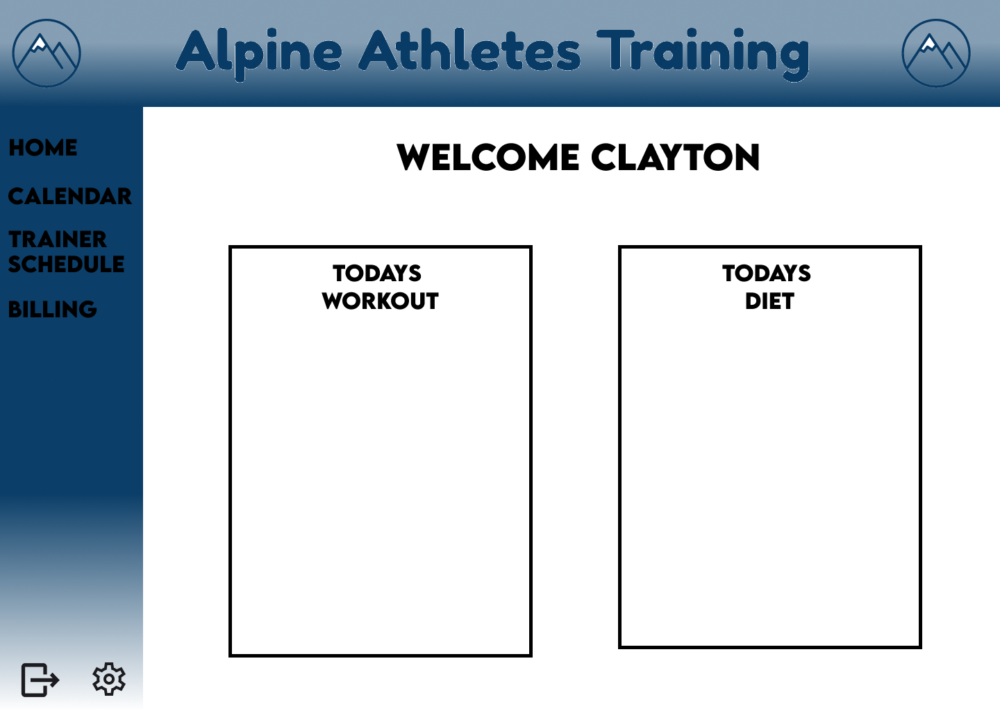

<div align="center">
<h1>Vegan Liftz Training App</h1>
 <p align="center">
  

<br>
<br>

<h4>Progressive Web Application that enables a simple and intuitive interface for clients to get their daily workout and diet plans from their personal trainers.</h4>
</div>

<br>
<br>

## Table-of-Contents

* [Goal](#description)
* [Features](#features)
* [Installation](#installation)
* [Wireframe](#wireframe)
* [Software Stack](#software-stack)
* [Hardware Stack](#hardware-stack)
* [Demo](#demo)


<br>

## [Goals](#table-of-contents)

TBD...

<br>
<br>


## [Features](#table-of-contents)

TBD...

<br>
<br>

## [Installation](#table-of-contents)

* Server/API

```
    1) npm run buildServer
    2) npm run startServer
```
<br>

* Client
  ```
  1) npm run buildClient
  2) npm run startClientServe
  ```
<br>
<br>

## [Wireframe](#table-of-contents)

 <p align="center">
  
  <p align="center"><strong>Home Page</strong></p>
</p>

<br>
<br>

## [Software Stack](#table-of-contents)

* **Databases**
  * MongoDB (non-relational)
    * 
    * 
    * 
    * 
    * 

<br>

* **Server** (Node 18.6.0)
  * NPM Packages
    *
    *
    *
    *
    *
    *
    *
    *
    *
    *
    *
    *
    *
    *
    *
    *
    *
    *
    *
    *
    *

<br>

* **Client** (React 18.2.0)
  * NPM Packages
    *
    *
    *
    *
    *
    *
    *
    *
    *
    *
    *
    *
    *
    *
    *
    *
    *
    *
    *
    *
    *
    *
    *
    *
    *

<br>


## [Hardware Stack](#table-of-contents)

**Host: Railway**
  * Client:
  * API:
  <br>

**Database: Self Host via Docker**
  * MongoDB
  <br>

**Version Control: GitHub**
  * https://github.com/DesertCow/boardClubApp
  <br>

**Cloud Storeage: AWS**
  * S3 - US West 1

<br>
<br>

## [Demo](#table-of-contents)

<div align="center">
<h2>Client Demo</h2>
<div/>
 <p align="center">
  
</p>

<div align="center">
<h2>Admin Demo</h2>
<div/>
 <p align="center">
  
</p>

<br>
<br>