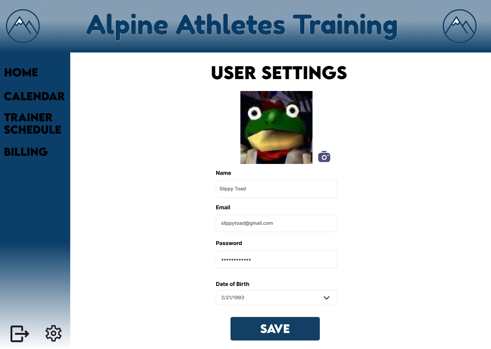

<div align="center">
<h1>Alpine Athletics Training App</h1>
 <p align="center">
  

<br>
<br>

<h4>Progressive Web Application that enables a simple and intuitive interface for clients to get their daily workout and diet plans from their personal alpine trainers.</h4>
</div>

<br>
<br>

## Table-of-Contents

* [Goal](#description)
* [Features](#features)
* [Installation](#installation)
* [Software Stack](#software-stack)
* [Hardware Stack](#hardware-stack)
* [Wireframe](#wireframe)
<!-- * [Demo](#demo) -->


<br>

## [Goals](#table-of-contents)

TBD...

<br>
<br>


## [Features](#table-of-contents)

TBD...

<br>
<br>

## [Installation](#table-of-contents)

* Server/API
  ```
      1) npm run buildServer
      2) npm run startServer
  ```
<br>

* Client
  ```
  1) npm run buildClient
  2) npm run startClientServe
  ```
<br>
<br>


## [Software Stack](#table-of-contents)

* **Databases**
  * MongoDB (non-relational)
    * events
    * users
    * trainers

<br>

* **Server** (Bun 1.0.3)
  * NPM Packages
    * @apollo/server (4.9.3)
    * cors (2.8.5)
    * express (4.18.2)
    * figlet (1.6.0)
    * graphql (16.8.1)
    * mongoose (7.5.3)

<br>

* **Client** (React 18.2.0)
  * NPM Packages
    * @apollo/client (3.8.4)
    * @emotion/react (11.11.1)
    * @ericz1803/react-google-calendar (4.3.1)
    * bootstrap (5.3.2)
    * moment (2.29.4)
    * react (18.2.0)
    * react-big-calendar (1.8.4)
    * react-bootstrap (2.8.0)
    * react-dom (18.2.0)
    * react-loader-spinner (5.4.5)
    * react-router-dom (6.16.0)
    * react-scripts (5.0.1)

<br>


## [Hardware Stack](#table-of-contents)

**Host: Railway**
  * Client:
  * API:
  <br>

**Database: Self Host via Docker**
  * MongoDB
  <br>

**Version Control: GitHub**
  * https://github.com/DesertCow/boardClubApp
  <br>

**Cloud Storeage: AWS**
  * S3 - US West 1

<br>
<br>

## [Wireframe](#table-of-contents)

<div align="center">
<h2>Login Page</h2>
<div/>
 <p align="center">
  
</p>

<br>
<br>

<div align="center">  
  <h2>Home Page</h2>
<div/>
<p align="center">
  
</p>

<br>
<br>

<div align="center">
  <h2>Calendar</h2>
<div/>
<p align="center">
  
</p>

<br>
<br>

<div align="center">
  <h2>Trainer Schedule</h2>
<div/>
<p align="center">
  
</p>

<br>
<br>

<div align="center">
  <h2>Billing</h2>
<div/>
<p align="center">
  
</p>

<br>
<br>

<div align="center">
  <h2>User Settings</h2>
<div/>
<p align="center">
  
</p>

<br>
<br>